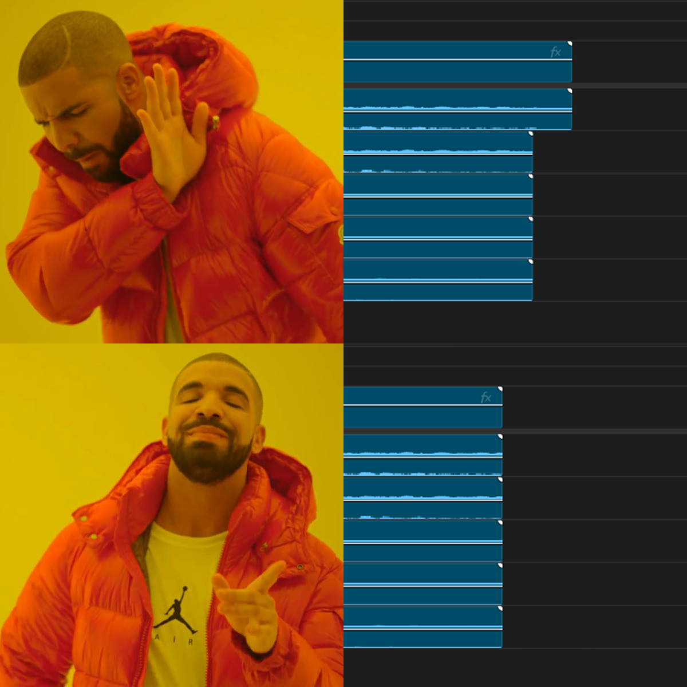

# obs-premiere-patch

OBS plugin (Windows, 64-bit) that fixes recordings for use in Premiere Pro.

## What it does

- **Chapter markers** — automatically translates OBS chapter markers into Premiere Pro's XMP format
- **A/V sync fix** — corrects a timing issue that causes audio to be shorter than the video length



## Requirements

- OBS Studio 31.x (64-bit, Windows)

## Installation

Download `obs-premiere-patch.dll` from [Releases](https://github.com/CalvFletch/obs-premiere-patch/releases) and copy it to:

```
C:\Program Files\obs-studio\obs-plugins\64bit\
```

Restart OBS.

## Usage

The plugin runs automatically after every recording. Settings and manual tools are in **Tools → Premiere Patch**:

## Building

Requires Visual Studio 2022, CMake 3.24+, and the OBS plugin build system.

```powershell
cmake --preset windows-x64
cmake --build build_x64 --config RelWithDebInfo
```
