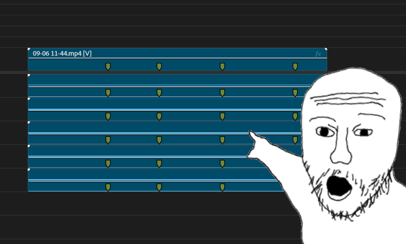

# OBS Premiere Patch

OBS plugin (Windows, 64-bit) that fixes recordings for use in Premiere Pro.

## Features

### Chapter Markers

Automatically translates OBS chapter markers into Premiere Pro's XMP format. Markers appear across all tracks in the timeline the moment you import the clip — no manual work required.



### A/V Sync Fix

Corrects a timing issue that causes audio tracks to end shorter than the video length, which causes Premiere to misalign audio on the timeline.


## Requirements

- OBS Studio 31.x (64-bit, Windows)

## Installation

Download `obs-premiere-patch.dll` from [Releases](https://github.com/CalvFletch/obs-premiere-patch/releases) and copy it to:

```
C:\Program Files\obs-studio\obs-plugins\64bit\
```

Restart OBS.

## Usage

The plugin runs automatically after every recording. No configuration required.

Additional settings and manual tools are available under **Tools → Premiere Patch** in OBS.

## Building

Requires Visual Studio 2022, CMake 3.24+, and the OBS plugin build system.

```powershell
cmake --preset windows-x64
cmake --build build_x64 --config RelWithDebInfo
```
